# Publication-Quality Figures Report

This report documents the generated figures, their captions, and the saved artifacts used to build them.

## Figure 1: Pearson correlation heatmap

**Description**: A grouped Pearson correlation heatmap showing relationships among actual GHI, lag features, rolling statistics, weather covariates, and solar geometry variables.

**Data Sources**:
- outputs/reports/residual_hybrid_predictions.csv

**Caption**: *Pearson correlation heatmap of irradiance, lagged, rolling, weather, and solar-geometry features used by the residual-hybrid pipeline.*

**Files**:
- outputs\figures\figure_1_correlation_heatmap.png
- outputs\figures\figure_1_correlation_heatmap.pdf

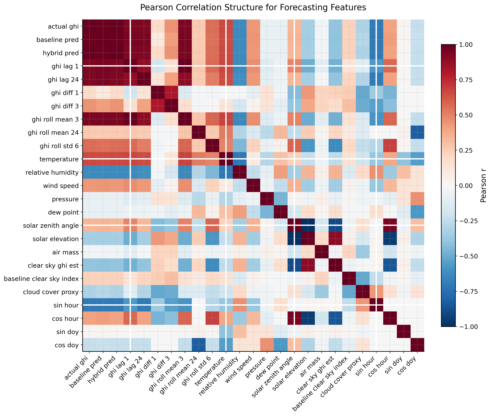

## Figure 2: Actual versus predicted time series

**Description**: Two-panel time-series comparison showing a full rolling-mean timeline and a short-window cloud-event zoom for the baseline GBT, LSTM, CNN-LSTM, and hybrid residual models.

**Data Sources**:
- outputs/benchmark/predictions/all_predictions.csv
- outputs/reports/model_forecast_comparison_summary.json

**Caption**: *Aligned actual-vs-predicted GHI comparison across the full benchmark timeline with a zoomed cloud-event window centered on a representative mixed-regime day.*

**Files**:
- outputs\figures\figure_2_actual_vs_predicted.png
- outputs\figures\figure_2_actual_vs_predicted.pdf

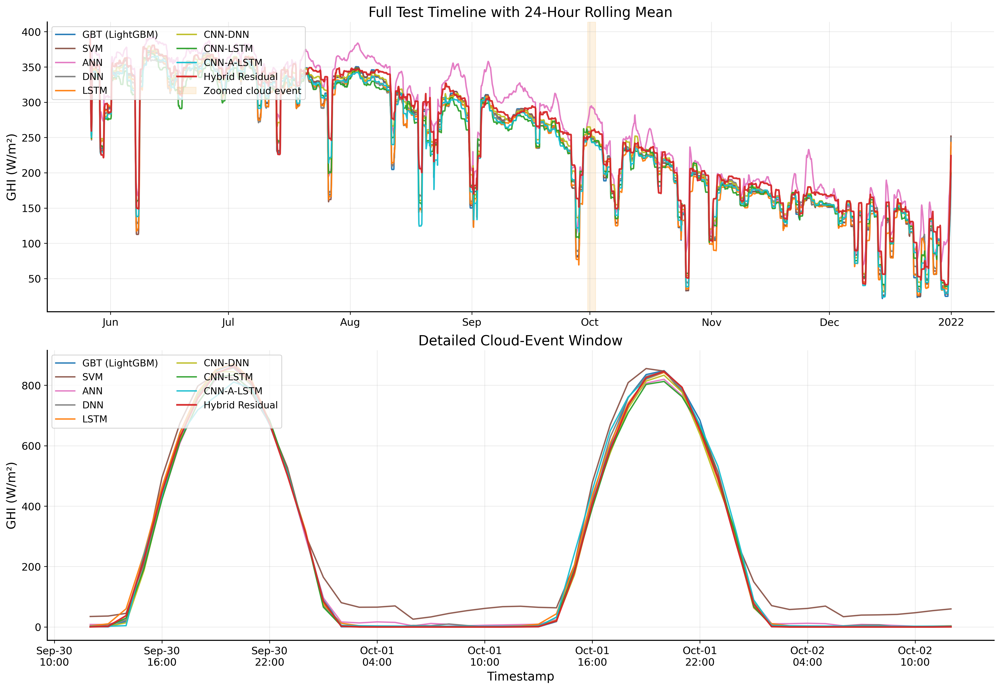

## Figure 3: Model performance comparison

**Description**: Two-panel benchmark comparison showing overall forecast accuracy and regime-aware operational metrics across all evaluated models.

**Data Sources**:
- outputs/benchmark/reports/model_comparison.csv

**Caption**: *Grouped comparison of benchmark models across RMSE, MAE, R², day MAE, peak MAE, cloud MAE, and transition MAE.*

**Files**:
- outputs\figures\figure_3_model_performance_comparison.png
- outputs\figures\figure_3_model_performance_comparison.pdf

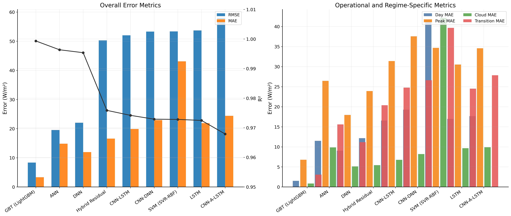

## Figure 4: Clear sky forecast comparison

**Description**: Single-day clear-sky comparison between the actual GHI trace and the baseline, attention, and hybrid predictions.

**Data Sources**:
- outputs/reports/model_forecast_comparison_predictions.csv
- outputs/reports/model_forecast_comparison_summary.json

**Caption**: *Clear-sky prediction trace on 2021-06-13, filtered from the regime-labelled comparison output.*

**Files**:
- outputs\figures\figure_4_clear_sky_prediction.png
- outputs\figures\figure_4_clear_sky_prediction.pdf

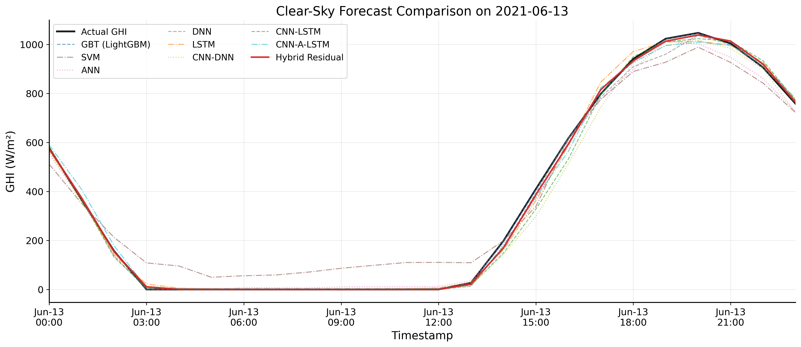

## Figure 5: Cloudy and partly cloudy forecast comparison

**Description**: Two-side panel comparison of actual versus predicted GHI on a partly cloudy mixed-regime day and a cloudy day.

**Data Sources**:
- outputs/reports/model_forecast_comparison_predictions.csv
- outputs/reports/model_forecast_comparison_summary.json

**Caption**: *Cloudy and partly cloudy forecast traces on 2021-10-01 and 2021-12-30, filtered from the regime-labelled comparison output.*

**Files**:
- outputs\figures\figure_5_cloudy_prediction.png
- outputs\figures\figure_5_cloudy_prediction.pdf

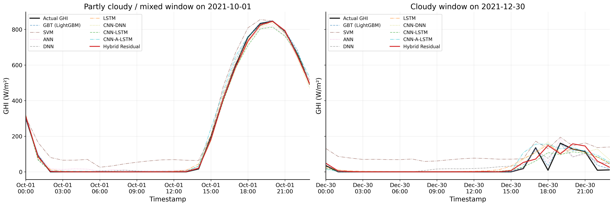

## Figure 6: Feature importance comparison

**Description**: Two-panel ranked feature-importance comparison highlighting the dominant predictors for the LightGBM and residual-hybrid models.

**Data Sources**:
- outputs/benchmark/reports/feature_importance.csv

**Caption**: *Side-by-side normalized feature-importance rankings for the benchmark GBT and the residual-hybrid model.*

**Files**:
- outputs\figures\figure_6_feature_importance.png
- outputs\figures\figure_6_feature_importance.pdf

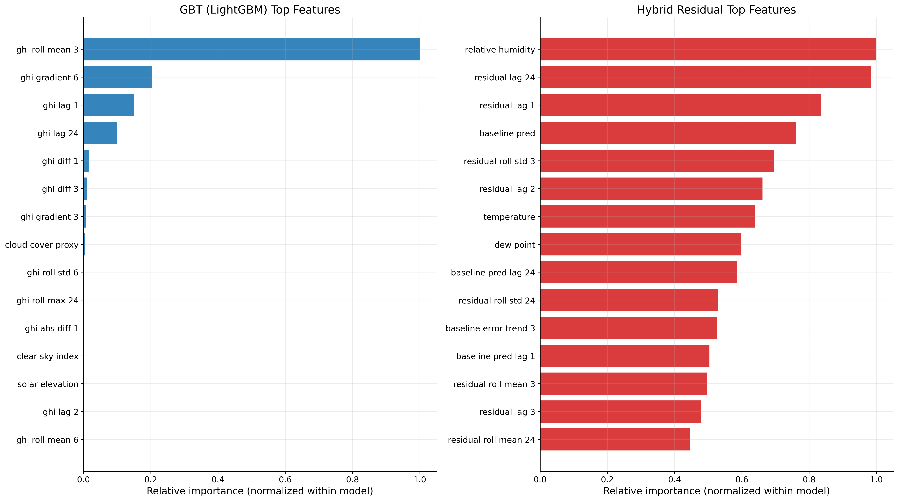

## Figure 7: Attention weights and training convergence

**Description**: Two-panel attention figure combining a genuine attention-weight profile from the trained network with the saved training-loss trajectory.

**Data Sources**:
- outputs/artifacts/attention_lstm_50epochs.h5
- outputs/artifacts/task_b_attention_lstm_trained.h5
- outputs/reports/attention_training_history.json
- dataset/*.csv

**Caption**: *Attention weights from the trained sequence model for a peak-irradiance sample, paired with the recorded training convergence history (fallback image: outputs\plots\sprint\attention_weights_50epochs.png).*

**Files**:
- outputs\figures\figure_7_attention_weights.png
- outputs\figures\figure_7_attention_weights.pdf

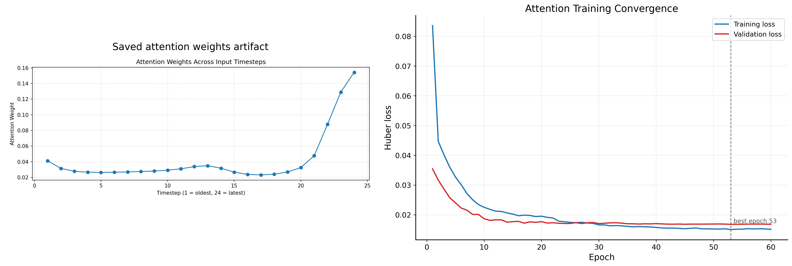

## Figure 8: Recursive forecast drift

**Description**: Bar-and-line figure showing how autoregressive forecast error grows from H=1 through H=48 hours ahead.

**Data Sources**:
- outputs/benchmark/reports/v2_validity_report.md

**Caption**: *Recursive-horizon RMSE and relative degradation values parsed from the scientific validity report.*

**Files**:
- outputs\figures\figure_8_recursive_drift.png
- outputs\figures\figure_8_recursive_drift.pdf

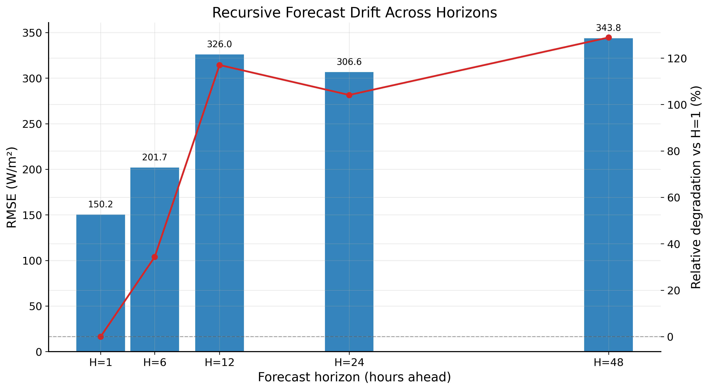

## Figure 9: Residual distribution diagnostics

**Description**: Three-panel residual diagnostic figure comparing benchmark error distributions for the GBT, LSTM, CNN-LSTM, and hybrid residual models.

**Data Sources**:
- outputs/benchmark/predictions/all_predictions.csv

**Caption**: *Residual histograms, KDE curves, and residual-versus-actual scatter plots for the headline benchmark models.*

**Files**:
- outputs\figures\figure_9_residual_distribution.png
- outputs\figures\figure_9_residual_distribution.pdf

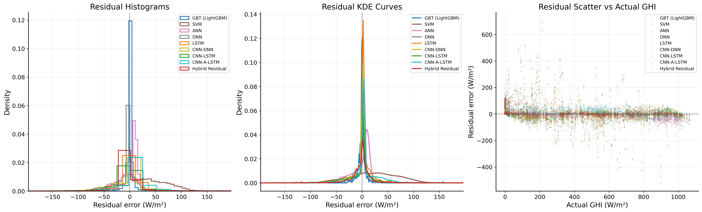

## Figure 10: Leakage impact and causality audit

**Description**: Two-panel leakage figure combining the published old-versus-V2 metric contrast with the causal audit checklist and implied R² values.

**Data Sources**:
- outputs/benchmark/reports/v2_validity_report.md
- outputs/benchmark/reports/leakage_audit.json
- outputs/benchmark/predictions/all_predictions.csv

**Caption**: *Leakage-impact comparison between the teacher-forced LightGBM baseline and the causal V2 regime ensemble, paired with the formal leakage audit that confirms all temporal integrity checks passed.*

**Files**:
- outputs\figures\figure_10_leakage_impact.png
- outputs\figures\figure_10_leakage_impact.pdf

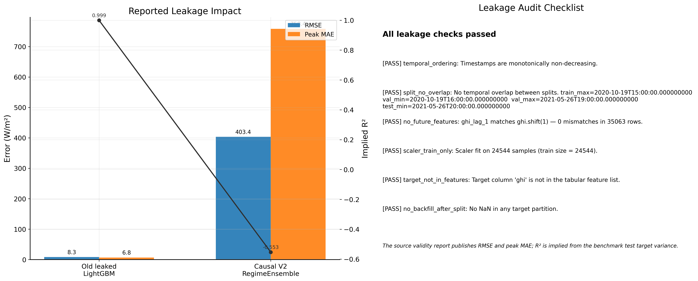

## Figure 11: Regime-wise performance comparison

**Description**: Two-panel grouped bar chart comparing regime-specific forecast errors across all the headline models.

**Data Sources**:
- E:\OE casestudy\code\outputs\benchmark\reports\regime_performance.csv

**Caption**: *RMSE and MAE across clear-sky, partly cloudy, and cloudy regimes for all benchmark models.*

**Files**:
- outputs\figures\figure_11_regime_wise_performance.png
- outputs\figures\figure_11_regime_wise_performance.pdf

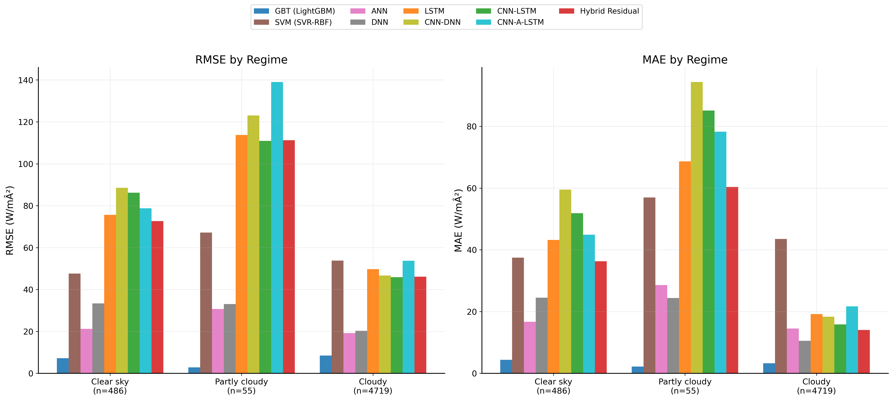
